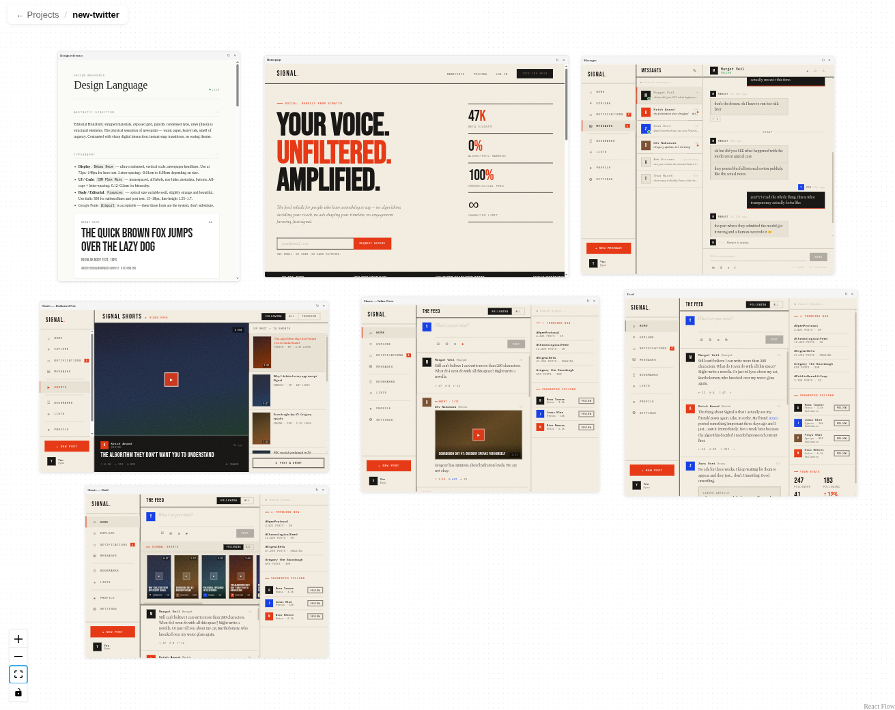
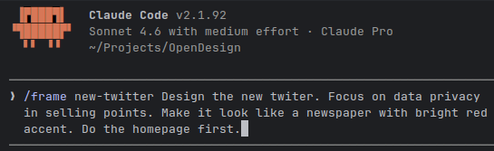

<p align="center">
  
</p>

An open-source, filesystem-native design tool that any AI coding agent can drive. Each frame is a self-contained HTML file; you drag them around, resize them, and edit them from either the canvas or your text editor — changes sync both ways.

An alternative to closed-source, cloud-hosted tools like Claude Design and Google Stitch. MIT licensed, runs locally, works with any agent.

Built on React, [`@xyflow/react`](https://reactflow.dev), and Vite.

<p align="center">
  <a href="site/media/hero.mp4"></a>
  <br />
  <em>Click to play the demo video</em>
</p>

<p align="center">
  
  <br />
  
</p>

## Why

Existing design tools store your work in a proprietary format. Frameground stores each frame as a plain HTML file on disk. That means:

- Your favorite AI coding agent can create, edit, and port frames directly — no plugin API, no headless browser.
- Frames render real code. What you see on the canvas is what ships.
- Everything is diff-able, `git`-able, and greppable.

## Quickstart

```bash
git clone https://github.com/basta/frameground.git
cd frameground
npm install
npm run dev
```

Open <http://localhost:5173>. Create a project, then describe a frame to your agent.


**Custom projects root:**

```bash
PROJECTS_ROOT=/path/to/your/projects npm run dev
```

Defaults to `./projects/` (gitignored).

## How it works

**Projects** are directories under `PROJECTS_ROOT`. Each project contains:

```
<project-id>/
  PROJECT.md                 project idea + frames list
  DESIGN.md                  design tokens (Google design.md spec — YAML front-matter)
  FEEL.md                    motion, composition, atmospherics (prose)
  design-reference.html      auto-generated live view of DESIGN.md + FEEL.md
  frames.json                [{ id, name, file }]
  .opendesign/layout.json    { [frameId]: { x, y, w, h } }
  <frame-id>.html            one file per frame, fully self-contained
```

`DESIGN.md` follows Google's [`design.md`](https://github.com/nicholasgasior/design.md) spec — YAML front-matter tokens (colors, typography, rounded, spacing, components) plus canonical prose sections. `FEEL.md` holds the creative dimensions the spec doesn't cover: motion, spatial composition, and backgrounds. Both are seeded on project creation and maintained by the `/frame` skill.

**Frames** are single HTML files with inline CSS/JS — no build step, no external deps (unless you want them). The canvas renders them via iframes.

**Two-way sync**: the dev server watches the filesystem with `chokidar` and streams change events over SSE. Edits in the canvas hit the HTTP API and are echoed back as events. Edits on disk (from your editor, or from an agent writing files directly) show up on the canvas as soon as the file is written.

## HTTP API

Mounted at `/api` on the dev server.

| Method | Path | Purpose |
|--------|------|---------|
| `GET` | `/api/workspace` | List projects root + project paths |
| `GET` / `POST` | `/api/projects` | List / create projects |
| `GET` | `/api/projects/:id/manifest` | Read `frames.json` |
| `GET` | `/api/projects/:id/layout` | Read `.opendesign/layout.json` |
| `GET` | `/api/projects/:id/design` | Parsed DESIGN.md tokens + sections, plus FEEL.md |
| `GET` | `/api/projects/:id/tokens.css` | CSS variables generated from design tokens |
| `PATCH` | `/api/projects/:id/design/tokens` | Deep-merge token patches into DESIGN.md |
| `GET` | `/api/projects/:id/suggestions` | List design suggestions |
| `DELETE` | `/api/projects/:id/suggestions/:id` | Dismiss a suggestion |
| `POST` | `/api/projects/:id/frames` | Create frame (writes HTML + manifest + layout atomically) |
| `PATCH` | `/api/projects/:id/frames/:frameId` | Rename / change file |
| `DELETE` | `/api/projects/:id/frames/:frameId[?deleteFile=true]` | Delete frame |
| `PATCH` | `/api/projects/:id/layout/:frameId` | Move / resize |
| `GET` | `/api/projects/:id/events` | SSE stream of filesystem changes |

Frame HTML is served at `/frames/:projectId/:file` for iframe loading.

## Skills for AI agents

Five [Claude Code](https://claude.ai/code) skills live in `.claude/skills/` (mirrored in `skills/`):

- **`/frame`** — create or update a single frame. Reads `PROJECT.md`/`DESIGN.md`/`FEEL.md`, picks a non-overlapping position, writes the HTML, and updates the manifest.
- **`/frontend-design`** — design advisor. Commits a project to a bold aesthetic direction (typography, color, motion, composition). Invoked by `/frame` for fresh projects; can also be used standalone.
- **`/port`** — port an existing codebase into a Frameground project, one frame per screen. Explores the source, extracts aesthetic signals, seeds `PROJECT.md`/`DESIGN.md`/`FEEL.md`, then spawns parallel subagents to port each screen. Supports `--redesign` (fresh direction) and `--append` (extend existing project).
- **`/alternatives`** — generate N parallel design takes on a single frame for side-by-side comparison. Auto-picks mode: *execution-shopping* (layout/composition variants within the committed aesthetic) when `DESIGN.md` is filled, or *direction-shopping* (each alt commits its own aesthetic) when empty. `--wild` forces direction-shopping; `--count N` controls how many (default 3).
- **`/suggest`** — generate AI-curated design tweak suggestions (palette or typography variants). Drops named variants into the Tokens panel where you can preview and apply them with one click.

The same skills are mirrored for other CLI coding agents so you can use whichever you prefer:

| Agent | Project instructions | Slash commands |
|-------|----------------------|----------------|
| [Claude Code](https://claude.ai/code) | `CLAUDE.md` | `.claude/skills/<name>/SKILL.md` |
| [opencode](https://opencode.ai) | `AGENTS.md` | `.opencode/commands/<name>.md` |
| [Codex](https://developers.openai.com/codex) | `AGENTS.md` | — (custom prompts deprecated; relies on `AGENTS.md`) |
| [Gemini CLI](https://geminicli.com) | `GEMINI.md` | `.gemini/commands/<name>.toml` |

`AGENTS.md` and `GEMINI.md` are symlinks to `CLAUDE.md`, and `.opencode/commands/*.md` are symlinks to the Claude `SKILL.md` files — they stay in sync automatically. The Gemini TOML files are hand-maintained copies because the format differs.

## Tokens panel

The canvas includes a live design token editor on the right edge. It displays the current `DESIGN.md` tokens organized by group (colors, typography, spacing, rounded, components) and lets you edit them in place — changes are previewed immediately and can be committed back to `DESIGN.md`. The panel also shows suggestions from the `/suggest` skill as clickable cards for instant preview and one-click application.

## Scripts

| Command | Purpose |
|---------|---------|
| `npm run dev` | Start the dev server (canvas + API + file watcher) |
| `npm run build` | Type-check and build for production |
| `npm run lint` | Run ESLint |
| `npm run test` | Run the server test suite (Vitest) |

## Project layout

```
src/              React app (canvas, pages, hooks, node types)
server/           Vite plugin: HTTP API + chokidar watcher + SSE
.claude/skills/   Claude Code skills (frame, frontend-design, port, alternatives, suggest)
skills/           Mirror of the above (for discoverability)
site/             Landing page (deployed to GitHub Pages)
```

## Contributing

Issues and PRs welcome. Run `npm run lint` and `npm run test` before opening a PR. CI runs the same checks on every push.

## License

MIT — see [LICENSE](LICENSE).
